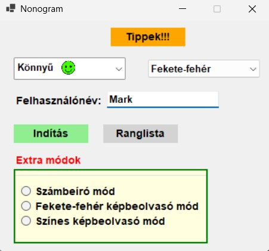
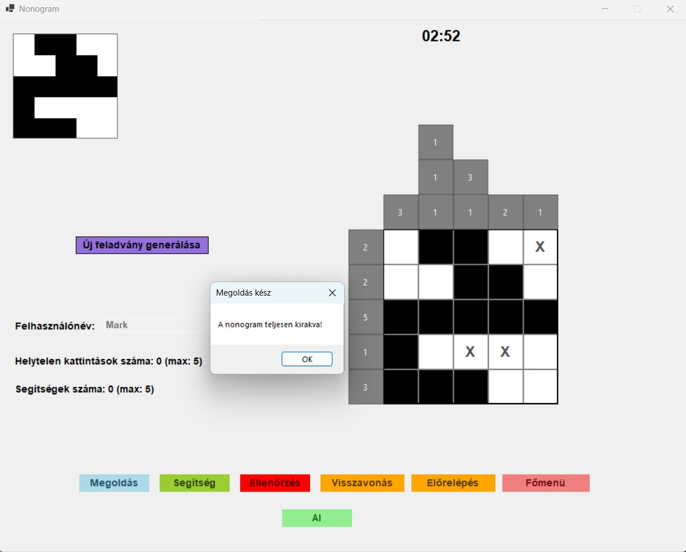
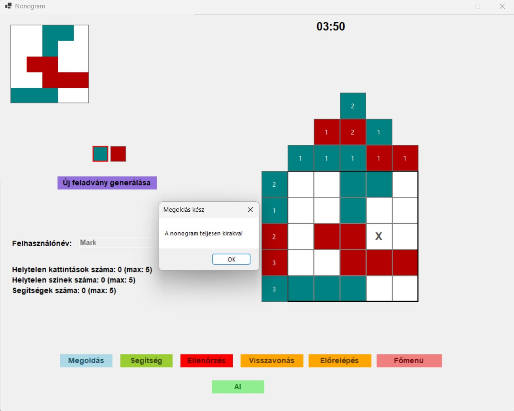
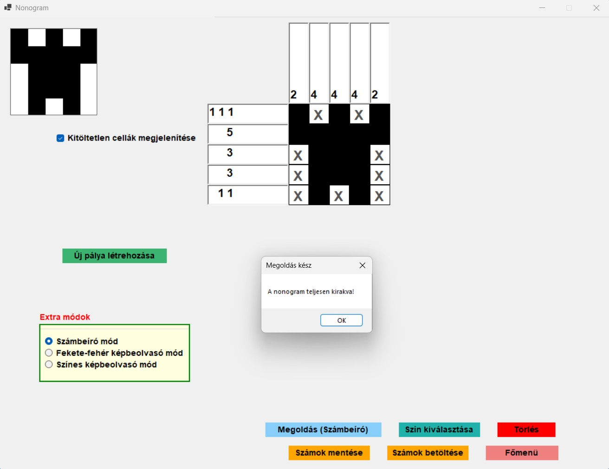
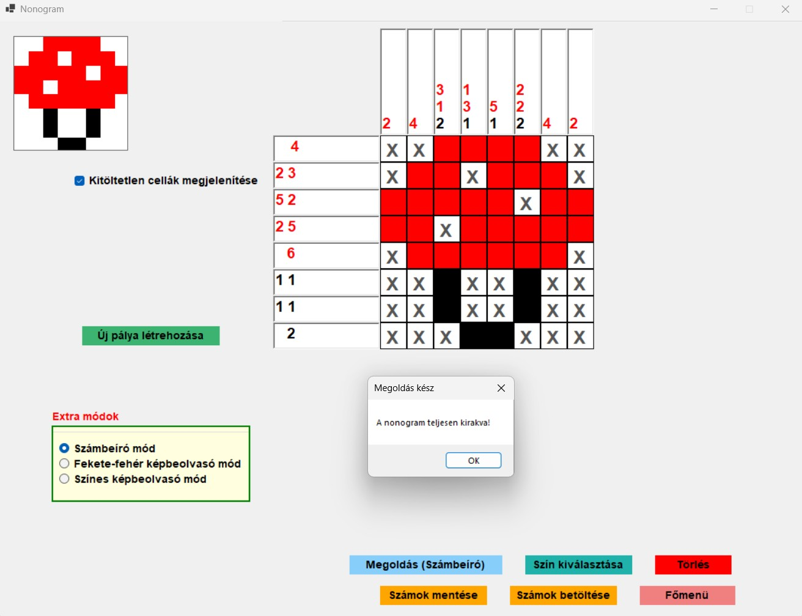
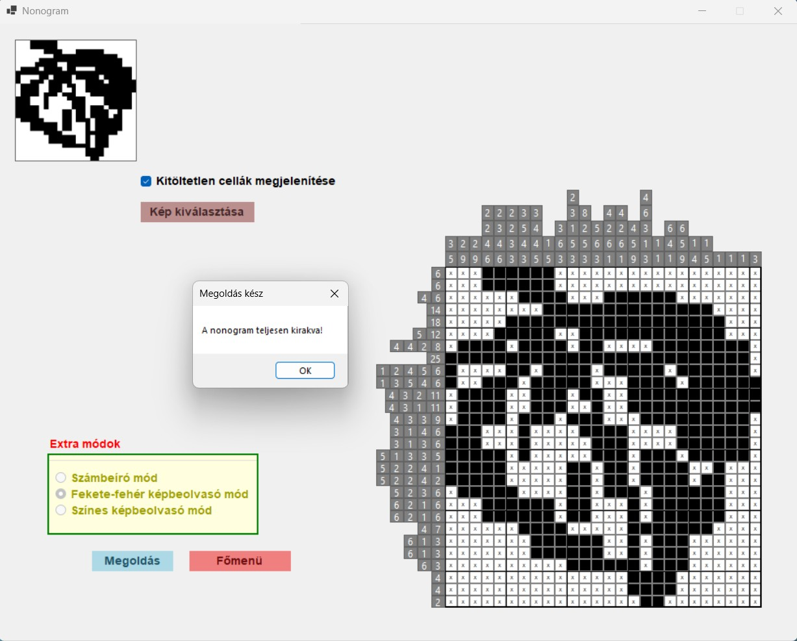
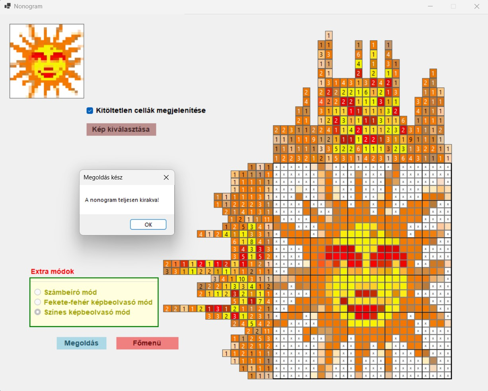

The aim of the thesis is to create an application that generates graphilogic (nonogram, Japanese crossword) type puzzles and supports their solution. The application is able to create tasks, provide their visual display, and provide the opportunity for interactive solution, error detection, and checking the correct solution.

<h3>Main page of my application</h3>

  

We have two types of nonograms: Black and white and multicolor

<h3>Black and white game mode nonograms</h3>

<h3>Multicolor game mode nonograms</h3>

<h3>Black and white entry mode nonograms</h3>

<h3>Multicolor entry mode nonograms</h3>

<h3>Black and white image scanning mode nonograms</h3>

<h3>Multicolor image scanning mode nonograms</h3>

